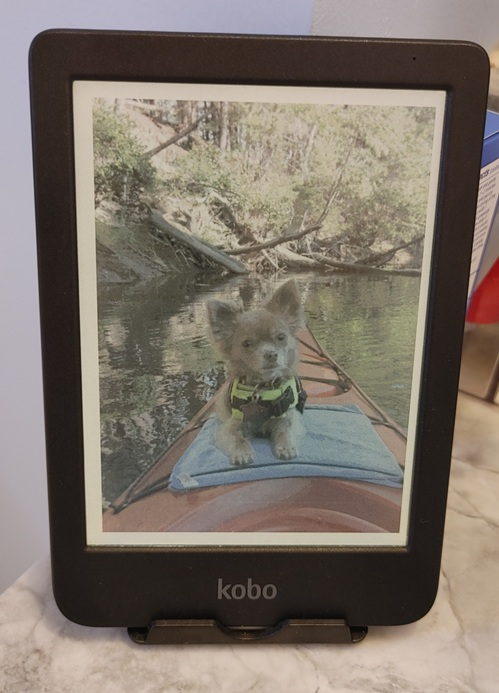

<div align="center">



</div>

## Introduction

I like e-ink photo frames.  I wanted to setup a photo album and place a kobo clara colour on a stand on the main bathroom sink, putting the kids in charge of changing the picture at their will.  It gives them a feeling of some power since they get to select the image and is something they enjoy.

I wanted to document this in case anyone wanted to do something similar.

## Prerequisites:
* kobo clara colour 
* calibre and calibre's command-line tools
* python and bash
* imagemagick
* Java 11 or higher
* Maven 3.6+
* a stand.  I am using the Moko 2 Pack Cell Phone Stand for Desk, Tablet Stand for 4"-11" Devices


I started out using tips found in this thread:
https://www.reddit.com/r/kobo/comments/158p6k0/ps_you_can_absolutely_set_a_nice_image_as_a/
But later decided I wanted to see these photos with the backlighting ON.
It worked far better than I expected.  With the brightness turned down to about 1/3, I get about a week of display time before I have to recharge the device.

## Instructions

### 1. Setup Kobo settings

On kobo 'more settings...Energy Saving': 
change 'Automatically go to sleep after' to 'Never'
change 'Automatically power off after' to 'Never'


### 2. Capture 3:4 aspect-ratio areas of your favorite photos
--------------------------------------------

I used AI to create a java program that allows the user to capture a 3:4 area of the screen.  This allows you to look at family photos and for each photo, start the selection process (on windows) by entering CTRL-ALT-K, then select area, then CTRL-ALT-K again to save that selected region to the downloads folder with the prefix ScreenSnap_ and the suffix .png which is a kobo requirement.

use 'build.bat' to compile the code, and use 'screensnap.bat' to run the program.  Minimize the window, open up your favorite image browser and start selecting areas from your photo album photos.  CTRL-ALT-K starts the selection rectangle, you can resize and move the selection area using the mouse, and CTRL-ALT-K will save the image to your windows downloads folder.

I transfer these images to a folder on my LAN that my Raspberry Pi has mounted and I've automated the next section below to convert the images for displaying on the kobo.


### 3. Convert these 3:4 aspect ratio .png images to 1072x1448 pixels
-----------------------------------------------------------------

For all following steps, I am using a raspberry pi.

I use 'kobo_process_images.py' in a cron entry to resize all images to 1072x1448 (and perform some additional processing features during the conversion).  The python code conversion line is:

    command = [
         "magick",
         str(src),
         "-auto-orient",
         "-background",
         "white",
         "-alpha",
         "remove",
         "-alpha",
         "off",
         "-resize",
         "1072x1448!",
         str(dst),
    ]

### 4. Run 'runme_build_epubs.sh' which will randomize filenames, create .html files, and then build epubs using the html files and the images.

I chose to randomize the images, you may want to skip that step.  The reason I did this is because I was finding, for example, too many back-to-back images of the same 'event' and wanted more randomness when switching to the next image.

runme_build_epubs.sh:
This script will build kobo-friendly picture 'books' in epub format, using all images in the current folder.
First it will look for duplicates by generating a hash of each image and looking for matches,
Next it will rename the pngs to a random hash name
Next it will convert, in batches of 100, images to the html needed to display those images
Next it will convert those .html files to .epub files
Finally it will move all processed .png images to the 'done' folder.  

```
python remove_duplicate_images.py  ;generates a hash based on each file's contents and deletes if already present in another filename
./random_rename_pngs.sh            ;generates a random hash and renames each file the hashname
./imgs2htmls.sh                    ;
./books2epubs.sh                   ;
mv *.png done                      ;make sure you have a 'done' folder first!
```

### 5. Bring the .epubs into Calibre and transfer them to the Kobo clara colour.   


Addendum - I also like to surf facebook and pinterest and when I find a cool family-friend comic or quote/advice, I save those images and add them as well.  This is another example of why the randomness feature was added.

---

# ScreenSnap - Java util to select the image
(More detailed info regarding the java util)

A lightweight screenshot utility with global hotkey support (CTRL-ALT-K) and system tray integration.

## Project Structure

```
screensnap/
├── src/main/java/
│   └── ScreenSnap.java         # Main application (com.screensnap package)
├── pom.xml                      # Maven configuration
├── build.bat                    # Windows batch build script
├── build.ps1                    # Windows PowerShell build script
└── target/
    └── ScreenSnap.jar           # Output: executable fat JAR with all dependencies
```

## Features

- Press **CTRL-ALT-K** globally to trigger screenshot capture
- Select area with crosshair overlay (3:4 aspect ratio)
- Auto-saves to Desktop with timestamp
- System tray integration with notifications
- Cross-platform (Windows, macOS, Linux)

## Prerequisites

- Java 11 or higher
- Maven 3.6+

## Building

### Option 1: Build a fat JAR (recommended - includes all dependencies)

```bash
mvn clean package
```

This creates `target/ScreenSnap.jar` which includes all dependencies and can be run on any machine with Java 11+.

### Option 2: Build without dependencies

```bash
mvn clean compile
```

## Running

### Run the fat JAR:

```bash
java -jar target/ScreenSnap.jar
```

### Or run directly with Maven:

```bash
mvn compile exec:java -Dexec.mainClass="ScreenSnap"
```

## Dependencies

- **jnativehook** (2.2.4) - Global keyboard hook for CTRL-ALT-K hotkey detection
- Java AWT/Swing - For GUI and screenshot capture

## How to Use

1. Start the application - a tray icon should appear
2. Press **CTRL-ALT-K** anywhere on your screen
3. A crosshair overlay will appear - drag to select the area to capture
4. Release mouse to save the screenshot
5. Right-click to cancel the selection, or press **ESC**
6. Screenshot is saved to `~/Desktop/ScreenSnap_YYYYMMDD_HHmmss.png`

## Troubleshooting

### "Cannot resolve symbol 'github'"
This means Maven dependencies haven't been downloaded yet. Run:
```bash
mvn clean package
```

### CTRL-ALT-K hotkey not working
- On Linux, you may need appropriate permissions for global keyboard hooks
- Ensure jnativehook is properly installed by checking the build output
- Some desktop environments or applications may intercept the hotkey
- If you need a different hotkey, edit `src/main/java/ScreenSnap.java`, find the `nativeKeyListener` section, and modify the key checks

### Tray icon not showing
- System tray may not be supported on your OS (e.g., some Linux desktop environments)
- The application will still work - just use the CTRL-ALT-K hotkey

## Architecture

- `ScreenSnap.java` - Main application class with global hotkey listener
- `SelectionOverlay` (inner class) - Handles screenshot selection UI and capture

## License

MIT License

